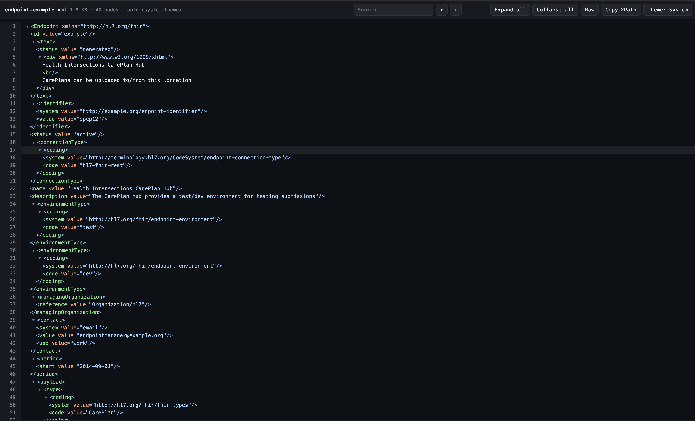

# Chrome XML Viewer

A Manifest V3 extension that replaces the browser's plain-XML page with a formatted, searchable tree. Runs offline in Chrome 88+ and other Chromium-based browsers; browser-specific XML handling may vary.

## Features

- Syntax-highlighted, pretty-printed tree with line numbers, indentation guides, and text nodes
- Collapsible elements — click a row to fold/unfold a subtree; **Expand all** / **Collapse all** buttons
- Search with match highlighting and previous/next navigation, plus a match counter
- Click any node to see its XPath in the status bar, with **Copy XPath** to the clipboard
- **Raw** toggle to switch between the formatted tree and the original XML source
- Node count, file size, and auto-collapse notice for large documents (>1.5MB)
- Invalid-XML handling: error banner with the browser's parse message and a raw view of the recovered content
- Light/dark themes following the browser's `prefers-color-scheme`, with a System/Light/Dark toggle persisted in `chrome.storage`
- Honours `<?xml-stylesheet?>` — XSLT-rendered documents are left untouched
- Works fully offline; no network requests and no data leaves the browser
- Handles XML served as `text/plain` (wrapped in `<body><pre>`) without re-fetching the URL

## Install in Chrome or another Chromium-based browser

1. Install dependencies with `npm install`.
2. Build the extension with `npm run build`.
3. Open the browser's extensions page (for example, `chrome://extensions/` or `edge://extensions/`).
4. Enable **Developer mode** (top right).
5. Click **Load unpacked** → select the generated `dist/` folder.
6. For local files: on the extension card click **Details** → enable **Allow access to file URLs** (wording may vary by browser).
7. Open `tests/fixtures/sample.xml` via `file://` or serve: `python3 -m http.server` → `http://localhost:8000/tests/fixtures/sample.xml`.

Run unit tests with `npm test`; run TypeScript checks with `npm run typecheck`.

## Test cases

- `tests/fixtures/sample.xml` — highlighting, CDATA, comments, PI, collapse, search, XPath
- `tests/fixtures/invalid.xml` — error banner + raw view
- Large file: duplicate `sample.xml` content to >1.5MB, confirm auto-collapse banner
- XSLT: add `<?xml-stylesheet type="text/xsl" href="style.xsl"?>` → viewer must NOT override
- Theme: change the browser or OS light/dark preference → viewer follows via `prefers-color-scheme`; toolbar **Theme** button cycles System → Light → Dark (persisted via `chrome.storage`)

## Structure

- `src/content.ts` — detect and parse the loaded XML, render tree/raw views, search/XPath
- `src/xml-utils.ts` — testable XML URL and byte-size helpers
- `tests/` — Vitest unit tests; `tests/fixtures/` — XML files for manual browser testing
- `public/manifest.json` — MV3, `<all_urls>` content script at `document_start`
- `public/viewer.css` — light/dark theme variables, tree/search/error styles
- `dist/` — generated unpacked extension; recreate with `npm run build`
